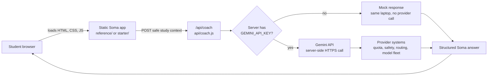
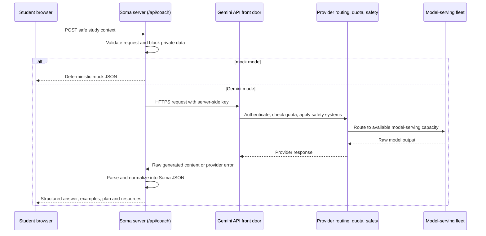
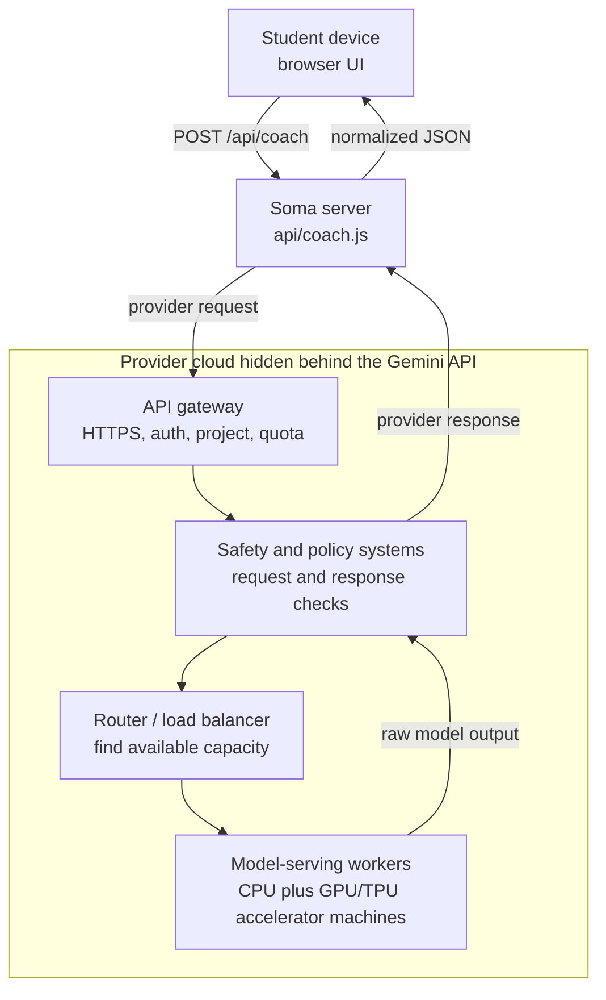
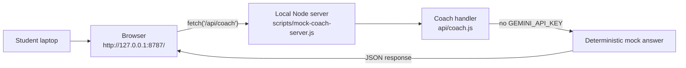
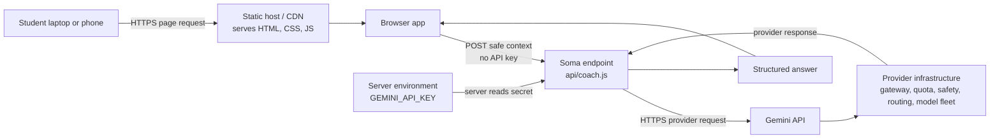
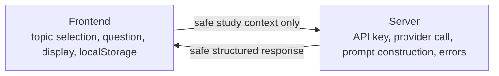

# Architecture

Use this with the [Code Map](./code-map.md), [`/api/coach`
Contract](./api-coach-contract.md), and [Testing And
Debugging](./testing-debugging.md).

This project is intentionally small. The goal is to teach the shape of an AI
tutor without introducing frameworks, databases, accounts, queues, or build
systems.

## The Amazing Part

When a student clicks the coach button, Soma can do one of two very different
things:

- In class, it can stay on one laptop and return a safe mock answer.
- In deployment, it can send one server-side request into a provider cloud where
  gateways, quota systems, safety systems, routers and accelerator fleets work
  together to produce one answer.

The student sees one button. Under the hood, that button crosses a real
architecture boundary:

```text
small app code -> server endpoint -> provider API -> distributed AI system
```

Soma is deliberately shaped so students can understand that whole journey
without needing to build the provider's cloud.

## One Question, Two Paths



The browser never talks directly to Gemini. The browser only calls
`/api/coach`. This keeps provider keys out of frontend code and student
machines.

## Journey Of One Ask Coach Click



The important lesson is not the exact number of machines. The important lesson
is the contract: Soma sends one safe request, the provider hides a distributed
system behind one API, and Soma returns one safe app response.

## Who Talks To Whom?

One click can involve several conversations:

| Conversation | Who talks | What it means |
|---|---|---|
| 1 | Browser -> static host | Load the app files. |
| 2 | Browser -> `/api/coach` | Send safe study context, not secrets. |
| 3 | `/api/coach` -> server environment | Read the private provider key. |
| 4 | `/api/coach` -> Gemini API | Ask the provider from the server side. |
| 5 | Gemini API -> provider systems | Route through auth, quota, safety and model serving. |
| 6 | `/api/coach` -> browser | Return a safe structured answer. |

In mock mode, conversations 4 and 5 disappear. That is why the same app can be
safe for a first workshop and still teach the shape of a real deployed AI app.

## What "The LLM Server" Really Means

There is usually no single visible computer named "the LLM." A production AI
provider hides many layers behind a simple API endpoint.



Large AI systems can use fleets of accelerator machines such as GPUs or TPUs.
They may route traffic across regions or zones for latency, capacity and
reliability. The exact count of machines for one request is provider-managed and
changes with model, traffic, region, batching, quota and deployment choices.
Depending on deployment and routing, a request may be served near the student or
may travel to infrastructure in another region. Soma should not guess that
location; it should design for the possibility that the answer comes back across
a real network, not from a magic local box.

For students, the useful mental model is:

```text
our app sends one request
the provider distributes work inside its cloud
our app gets one response
```

## Local Mock Path

Use this path when students run:

```bash
npm run serve:mock
```



In this mode, the student's machine is both the browser and the server. There
is no Google/Gemini network call. This is the safest first setup for a class.

## Deployed AI Path

Use this path when Soma is deployed and a private `GEMINI_API_KEY` is set on the
server.



Students do not own or run the LLM computers. They call an API. The provider
runs the large distributed system behind that API. Soma only needs one stable
contract: `POST /api/coach`.

## What Is Sent At Each Step

| Step | Caller | Receiver | What is sent | What must not be sent |
|---|---|---|---|---|
| Page load | Browser | Static host or local server | Request for HTML, CSS and JavaScript | Provider API key |
| Coach request | Browser | `/api/coach` | Safe study context, selected topic data, question, mode, resources | Names, marks, phone numbers, private school records, provider API key |
| Mock response | `api/coach.js` | Browser | Deterministic JSON answer for learning and tests | Fake claim that a real LLM was called |
| Provider request | `api/coach.js` | Gemini API | Server-side prompt, model settings, response schema, server-side key | Frontend secrets or private student data |
| Provider response | Gemini API | `api/coach.js` | Raw generated content or provider error | API key |
| Render response | `api/coach.js` | Browser | Normalized JSON answer, honest error, optional safe debug payload | Secret key or hidden provider URL with key |

## How Many Machines Are Involved?

For students, the simple answer is:

```text
mock mode: one laptop can run the whole learning loop
deployed mode: browser + Soma server + provider API + provider model fleet
```

For a real LLM provider, the answer is "many machines," not one magic computer.
A production LLM service commonly includes:

- API gateway machines to receive HTTPS requests,
- load balancers to route traffic,
- quota and rate-limit services,
- safety systems,
- model-serving workers running on CPU plus GPU or TPU accelerator machines,
- storage, cache and monitoring systems,
- multiple regions or zones for reliability and latency.

Soma does not need to know the exact machine count. The provider hides that
complexity behind the Gemini API. Students should understand the shape:

```text
our app sends one request -> provider distributes work -> our app gets one response
```

## What We Know Vs What The Provider Hides

| Question | What Soma knows | What the provider hides |
|---|---|---|
| Who sends the request? | `api/coach.js` sends the provider request from the server. | Which internal gateway machine receives it first. |
| What model is requested? | The configured `GEMINI_MODEL` value. | The exact serving topology for that model at that moment. |
| Is there a key? | The key is stored server-side in environment variables. | Provider-side credential storage and internal auth flow. |
| How is traffic controlled? | Soma sees quota and rate-limit errors. | The full quota, routing, batching and capacity decisions. |
| How many accelerators are used? | Soma knows the provider may use accelerator fleets. | The exact CPU/GPU/TPU count for one request. |
| What comes back? | Raw provider output or provider error, then normalized Soma JSON. | Internal retries, logs and monitoring details. |

This is normal cloud design. Good APIs hide complexity while exposing a stable
contract.

## Scale Thought Experiment

Ask students to imagine three moments:

| Moment | What changes | Architecture concern |
|---|---|---|
| One student testing | One browser asks one question. | Keep setup simple and visible. |
| A class of 30 students | Many browsers may ask at once. | Avoid leaking keys, handle errors, keep mock mode available. |
| A public app | Many schools or regions may use it. | Watch latency, quota, cost, safety, logging and provider reliability. |

The code stays beginner-sized, but the diagram shows why production AI apps need
careful boundaries.

## Tradeoffs Students Should Notice

| Choice | Benefit | Cost or risk | Soma's design |
|---|---|---|---|
| Mock mode first | Works offline from a class perspective and costs nothing. | It does not prove the real provider response quality. | `api/coach.js` returns deterministic mock JSON when no key is set. |
| Server-side provider call | Keeps keys out of the browser. | Requires a server endpoint and environment variables. | Browser calls `/api/coach`, never Gemini directly. |
| Structured JSON response | Easier for the UI to render safely. | The server must handle malformed provider output. | Server parses and normalizes before responding. |
| External AI provider | Gives access to powerful model infrastructure. | Adds latency, quota limits, pricing and provider errors. | Errors are shown honestly instead of pretending success. |
| Small beginner app | Easy to inspect and teach. | Not a full production platform. | No database, accounts, queues or framework required. |
| Sending context | Helps the answer fit the selected topic. | Too much or private context would be unsafe. | Send only safe topic data and the student question. |

## Main Pieces

### Static apps

- `reference/` powers the public app served at `/` and `/index.html`.
- `starter/` is the smaller workshop scaffold students can edit during lessons.

Both are plain HTML/CSS/JS. They can be served by any static server, but the
coach call only works when `/api/coach` is available.

### Topic data

- `reference/data.js` and `starter/data.js` hold local sample curriculum data.
- The app uses this data to build context for the coach.
- This is workshop sample content, not official curriculum material.

### Browser logic

`reference/app.js` does five main jobs:

1. Fill the topic, mode, grade, and learning-area controls.
2. Build a safe request object from the selected topic and student question.
3. Send that request to `/api/coach`.
4. Render the structured coach response.
5. Show the optional Debug Lab and Keep Learning section.

### Server endpoint

`api/coach.js` receives `POST /api/coach` requests.

It handles:

- method checks,
- JSON body parsing,
- personal-data blocking,
- mock/demo fallback,
- Gemini provider calls when configured,
- provider error handling,
- sanitized debug payloads.

### Mock/demo logic

`api/coach.js` builds deterministic responses for local demos and tests. It
also contains the personal-data checks used by the server.

Mock mode matters because students and mentors can test the app without a paid
or private provider key.

### Local server

`scripts/mock-coach-server.js` serves the static files and wires `/api/coach` to
`api/coach.js`. It also loads `.env` for local testing.

### Tests

`tests/soma-student.spec.js` uses Playwright to test:

- public app success flow,
- workshop scaffold success flow,
- follow-up flow,
- local progress checkboxes,
- quota and network errors,
- personal-data blocking,
- desktop and mobile viewports.

## Data Boundary

Keep this boundary clear:



If a value is secret, it belongs on the server. If a value is student-facing, it
must be safe to show in the browser.

## Debug Boundary

The Debug Lab is for learning. It shows the safe request, prompt shape,
provider request shape, raw return, parsed response, lab settings, and boundary
notes.

It must never show:

- actual API keys,
- key-bearing provider URLs,
- private student data,
- internal-only debug flags.

## How This Becomes A Lesson

Use this doc in two passes:

1. In [Lesson 3: Soma App Architecture](./workshop/lessons/03-soma-architecture.md),
   focus on the first diagram: browser, `/api/coach`, mock mode and server-side
   keys.
2. In [Lesson 7: Calling The LLM](./workshop/lessons/07-calling-the-llm.md),
   focus on the sequence diagram and provider cloud diagram: gateway, quota,
   safety, routing, model-serving fleet and tradeoffs.

Ask students to explain the journey in one sentence:

```text
My browser sends safe learning context to Soma; Soma protects the key and calls
the provider; the provider hides many machines behind one API; Soma sends back a
safe structured answer.
```

## Deeper Reading

- Gemini API docs: https://ai.google.dev/gemini-api/docs
- Gemini API rate limits: https://ai.google.dev/gemini-api/docs/rate-limits
- Google Cloud Load Balancing docs: https://docs.cloud.google.com/load-balancing/docs
- Google Cloud regions and zones: https://docs.cloud.google.com/docs/geography-and-regions
- Google Cloud TPU architecture: https://docs.cloud.google.com/tpu/docs/system-architecture-tpu-vm
- Google Cloud TPU v4 Pod scale example: https://docs.cloud.google.com/tpu/docs/v4
- Google Cloud AI and ML architecture guides: https://docs.cloud.google.com/architecture/ai-ml
