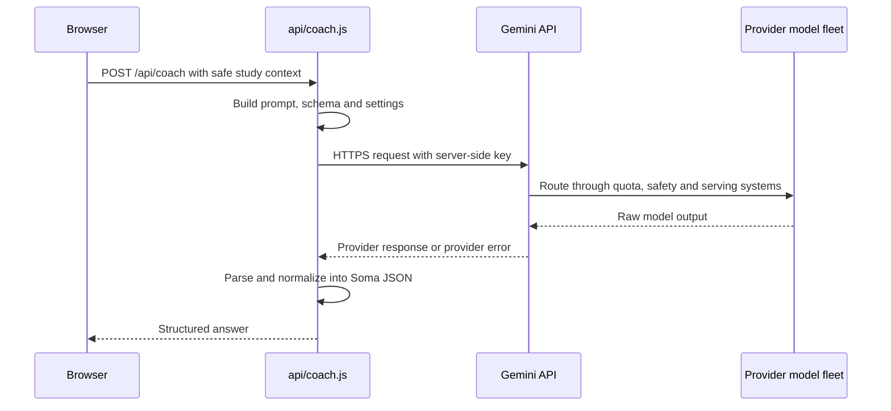
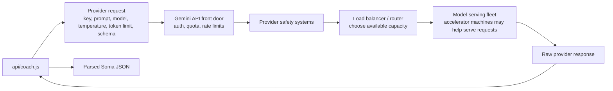

# Lesson 7: Calling The LLM

Time: 35-40 minutes

Audience: students who understand frontend/backend boundaries.

## Learner Hook

When you click the coach button, a message can travel to a model provider and
back faster than you can sharpen a pencil. In the reference app that button may
say **Ask Soma**; in the starter scaffold it may be the button that calls
`/api/coach`. This lesson follows that trip from browser to server to AI and
back.

## Try This Now

In Debug Lab, set temperature to `0.1` and run a question. Then set it to `1.5`
and run the same question again. Compare which answer feels more predictable.

## Real-World Connection

Voice assistants use a similar shape: your device records a request, a server
processes it, an AI system prepares a response, and your device presents the
answer.

## Learning Goals

By the end, students can:

- explain what happens when `/api/coach` calls Gemini,
- identify model, temperature and token settings,
- explain structured output,
- explain quota and rate-limit errors,
- explain why provider keys stay server-side,
- describe why a provider API hides many machines behind one endpoint.

## Key Ideas

An LLM call is a network request from the server to a model provider.

The browser sends safe study context to `/api/coach`. The server builds the
provider request. The provider returns text or structured output. The server
parses and normalizes it before the browser renders it.

## Call Flow



The full visual version is in [Architecture](../../architecture.md), especially
**Journey Of One Ask Coach Click** and **What "The LLM Server" Really Means**.

## Provider Infrastructure Flow

When Soma uses Gemini mode, `api/coach.js` does not talk to one visible machine
named "the LLM." It talks to a provider API. The provider runs the distributed
system behind that API.



Plain-language version:

```text
our server asks the provider API
the provider spreads work across its cloud
our server gets one answer back
the browser never sees the key
```

Do not tell students an exact number of machines is required. For real LLM
services, the number depends on model size, traffic, region, batching, hardware,
quota and provider deployment. The useful idea is that a production LLM service
is distributed across many systems, while Soma sees one API.

## Tradeoffs Behind One Call

| Tradeoff | Why students should care |
|---|---|
| Latency | A real provider call crosses the network and may travel to another region before returning. |
| Cost and quota | Each provider call can count against rate limits or billing, so apps should not call the LLM for every tiny task. |
| Privacy | The browser must not send private student data or provider keys. |
| Reliability | Provider errors, network failures and malformed output can happen, so the app needs honest error handling. |
| Scale | The provider can run large accelerator fleets, but Soma should still send small, focused requests. |
| Testing | Mock mode proves the app flow without depending on live provider output. |

## Find It In This Repo

| File | Why It Matters |
|---|---|
| `api/coach.js` | Contains `callGemini()`, `buildGeminiCall()`, and error handling. |
| `.env.example` | Documents `GEMINI_API_KEY` and `GEMINI_MODEL`. |
| `docs/api-coach-contract.md` | Documents the app-level request and response contract. |
| `docs/testing-debugging.md` | Shows how to inspect Debug Lab and avoid leaking keys. |

## Map To Soma Code

- Server endpoint: `api/coach.js` `module.exports = async function handler`.
- Provider model default: `api/coach.js` `GEMINI_MODEL`.
- Provider request builder: `api/coach.js` `buildGeminiCall()`.
- Provider call: `api/coach.js` `callGemini()`.
- Provider error wording: `api/coach.js` `providerErrorMessage()`.
- Mock fallback: `api/coach.js` `if (!GEMINI_API_KEY)`.
- Lab settings UI: `reference/index.html` experiment controls.
- Related lab: [Lab D: Change Model Settings And Observe Variability](../labs/README.md#lab-d-change-model-settings-and-observe-variability).
- Helpful prompt: [Fix /api/coach 404 Or 429](../../student/ai-coding-prompts.md#fix-apicoach-404-or-429).

## Important Settings

These settings travel from Soma's server to the provider API, not from the
browser directly to Gemini.

Model:

```js
const GEMINI_MODEL = process.env.GEMINI_MODEL || "gemini-3.1-flash-lite";
```

Temperature:

```js
temperature: 0.7
```

Lower temperature usually makes output more predictable. Higher temperature can
make output more varied.

Max output tokens:

```js
maxOutputTokens: 4096
```

This limits how much the model can return.

Structured response:

```js
responseMimeType: "application/json"
```

Soma asks for JSON because the browser needs predictable fields.

## Debug Lab Overrides

The Debug Lab can send temporary lab settings:

- model,
- temperature,
- max output tokens,
- system prompt,
- user prompt.

The server sanitizes those values before using them:

- model must match a safe string pattern,
- temperature is clamped between 0 and 2,
- max tokens are clamped,
- prompt overrides are trimmed and length-limited.

## Error Handling

The server does not pretend provider errors worked. It returns honest errors for:

- invalid JSON request,
- personal-data block,
- quota or rate limit,
- provider rejection,
- empty provider response,
- malformed provider response.

The frontend then shows the error clearly.

## What Can Fail In The Cloud Path

| Place | Example failure | What Soma should do |
|---|---|---|
| Browser to Soma server | local server is not running | Show that `/api/coach` is unavailable. |
| Soma server input check | request is invalid JSON | Return a clear 400 error. |
| Safety check | request includes personal data | Block before provider use. |
| Provider API gateway | key, quota or rate-limit problem | Return an honest provider/quota error. |
| Model response | empty or malformed output | Return an honest 503-style error. |
| Browser rendering | response shape is missing fields | Normalize or show a clear error instead of pretending. |

## Live Demo

1. Open the app in mock mode.
2. Ask a question.
3. Open Debug Lab.
4. Inspect the provider request shape.
5. Explain why mock mode has no external provider request.
6. Change temperature in Debug Lab and run again.

Optional mentor-only demo: configure real Gemini server-side and compare the
debug provider field. Do not show the API key.

## Student Exercise

Task: explain one provider setting.

Choose one:

- model,
- temperature,
- max output tokens,
- response schema.

Write:

1. what it controls,
2. where it appears in `api/coach.js`,
3. how changing it could affect the answer,
4. what risk it could introduce.

Stretch: test a temperature change in Debug Lab.

## Reflection Questions

- Why is the model call server-side?
- Why is JSON useful for app rendering?
- What should the app do when quota is exhausted?
- Why should tests avoid exact wording from real AI output?
- What should never appear in Debug Lab?

## Mentor Notes

Keep this lesson provider-aware but not provider-locked. Gemini is the current
provider path in this app, but the architectural idea is broader: server-side
adapter, safe request, structured response, honest errors.

## Deeper Reading

- Gemini API docs: https://ai.google.dev/gemini-api/docs
- Gemini rate limits: https://ai.google.dev/gemini-api/docs/rate-limits
- Google Cloud Load Balancing docs: https://docs.cloud.google.com/load-balancing/docs
- Google Cloud regions and zones: https://docs.cloud.google.com/docs/geography-and-regions
- OpenAI Safety Best Practices: https://developers.openai.com/api/docs/guides/safety-best-practices

## Inspiring Resources

- 3Blue1Brown: But what is a GPT? - https://www.youtube.com/watch?v=wjZofJX0v4M
- TensorFlow Playground - https://playground.tensorflow.org/
